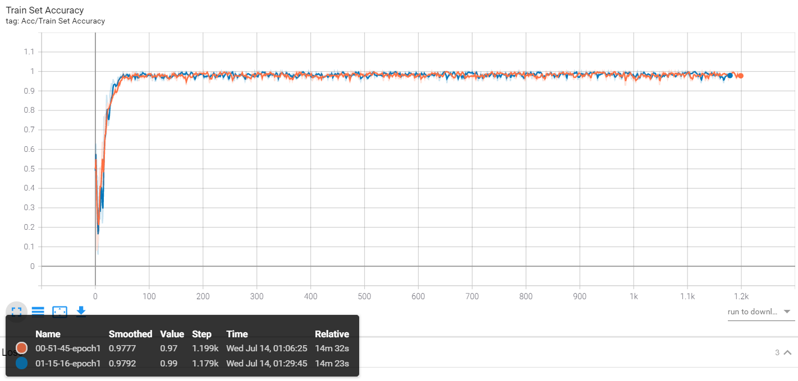
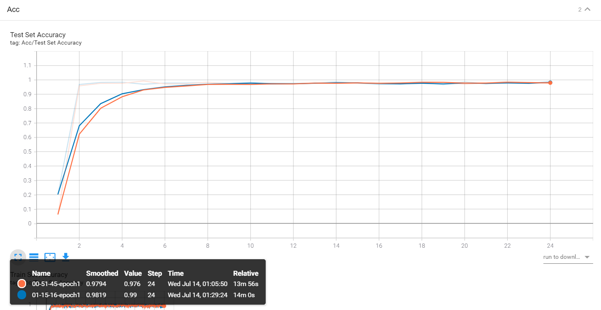
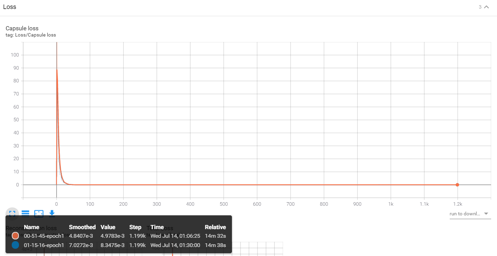
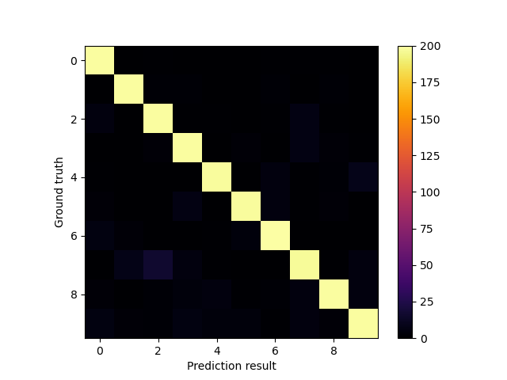

# CapsNet

---

My own implementation of CVPR 2017 paper by [Sara Sabour](https://arxiv.org/search/cs?searchtype=author&query=Sabour%2C+S), [Nicholas Frosst](https://arxiv.org/search/cs?searchtype=author&query=Frosst%2C+N), [Geoffrey E Hinton](https://arxiv.org/search/cs?searchtype=author&query=Hinton%2C+G+E): [*Dynamic Routing Between Capsules*](https://arxiv.org/abs/1710.09829). This is, by far, the hardest model I've ever trained, damn it. The first version of capsule network is simple, and in the paper, it is implemented for MNIST classification, which is also the implementation of mine. My implementation in Pytorch 1.7 is simpler than those of others, I assume. Yet it took me a long time to find out what was wrong in my original implementation, I found some parts of the paper confusing...

---

### Usage Guidance

To run this code, please do as follows (windows 10). `test_caps.py` is the only executable file in this repository. Make sure the working directory is correctly set to `.\\py\\`.

```shell
cd .\\py\\
python .\\test_caps.py -d -c --batch_size=100
```

The available  arguments are (run `python .\\test_caps.py --help` to find out)

```shell 
usage: test_caps.py [-h] [--epochs epochs] [--batch_size BATCH_SIZE]
                    [--routing_iter ROUTING_ITER] [--save_time SAVE_TIME]
                    [--gamma GAMMA] [--recons_ratio RECONS_RATIO]
                    [--test_time TEST_TIME] [-d] [-c] [-l]

optional arguments:
  -h, --help            show this help message and exit
  --epochs EPOCHS     Training lasts for . epochs
  --batch_size BATCH_SIZE
                        Batch size
  --routing_iter ROUTING_ITER
                        Dynamic routing iteration number
  --save_time SAVE_TIME
                        Save generated img every <> batches
  --gamma GAMMA         Exponential lr coefficient
  --recons_ratio RECONS_RATIO
                        The ratio of reconstruction error
  --test_time TEST_TIME
                        Test frequency for validation set
  -d, --del_dir         Delete dir ./logs and start new tensorboard records
  -c, --cuda            Use CUDA to speed up training
  -l, --load            Load the trained '.pth' model
```

Also, be sure to have: `imgs`, `models`, etc. in the root directory. My `.gitignore` ignores all these for repository tidiness.

---

### Directory Structure

- `imgs`: Keeping the reconstructed images.
- `models`: Where the `.pth` files are stored.
- `py`: Implementations
- `logs`: Tensorboard scalar records.

---

### Requirements

Run: 

```shell
python -m pip install -r requirements.txt
```

To find out. The most important requirement (env) is Pytorch(1.7) and CUDA(10.1), tensorboard support is also needed, which requires you to have TensorFlow on your device.

---

### Results

I have trained the model for 5 epochs, for in each epoch, batch size = 50, which makes 1200 batches. '5 epochs' is enough for showing that capsule network works and my implementation is correct.

After 5 epochs of training, I have run 2 more single-epoch training, with exponentially-decreasing learning rate, gamma is selected to be 0.998, wishing to do a little bit fine-tuning job. The training acc, test acc and confusion matrix are shown as follows:

Acc (not fine-tuned is about 98.4% on test set, while nearly 100% on the train set).

|                 Acc on train set                  |                  Acc on test set                  |
| :-----------------------------------------------: | :-----------------------------------------------: |
|                               |                                |
|                       Loss                        |                 Confusion matrix                  |
|                                |                           |
|             Reconstructed images (1)              |             Reconstructed images (2)              |
|  |  |

